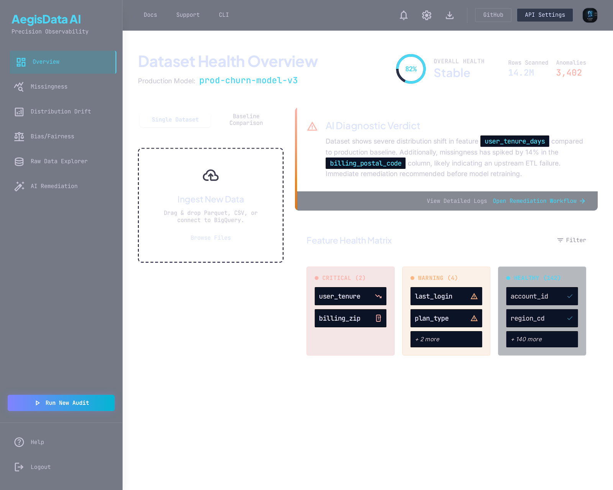
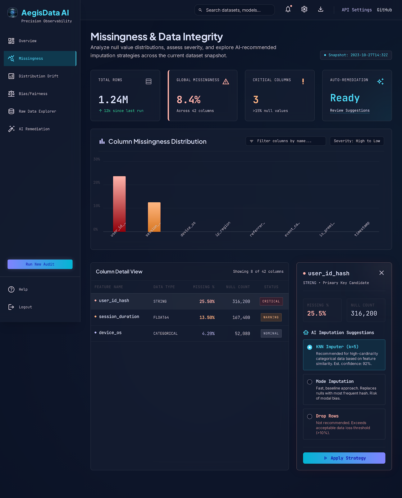
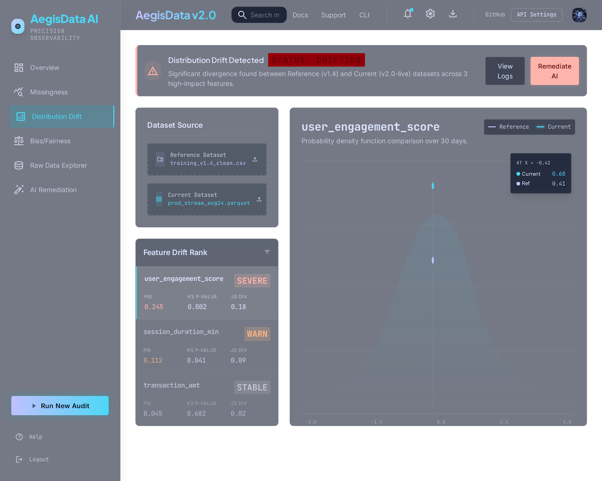
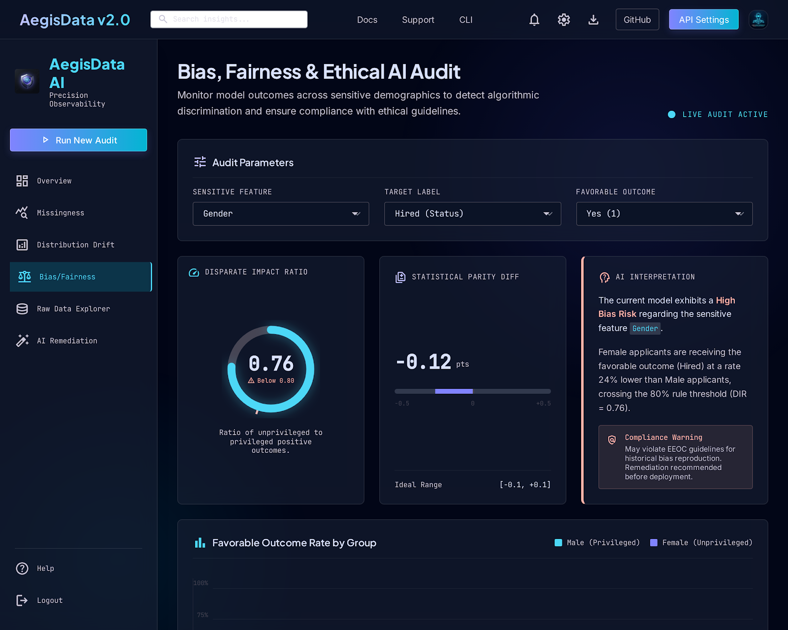
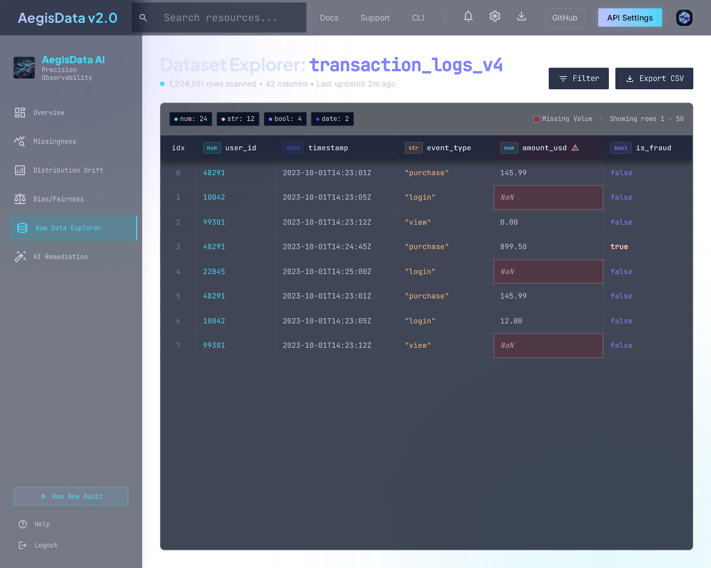

<div align="center">

# 🛡️ AI Dataset Quality Inspector (AegisData AI)

**Automated Statistical Dataset Quality & ML Data Governance Platform**

[](https://ai-dataset-quality-inspector.vercel.app/)
[](LICENSE)
[](https://www.python.org/)
[](https://fastapi.tiangolo.com/)
[](https://react.dev/)
[](https://vitejs.dev/)
[](#-testing)

<p align="center">
  <a href="https://ai-dataset-quality-inspector.vercel.app/"><strong>Explore the Live Interactive Dashboard »</strong></a>
</p>

</div>

---

## 🌟 Visual Proof & Dashboard Tour

<div align="center">
  <h3>📊 1. Overview Health Score & Metrics Dashboard</h3>
  
  <br/><br/>
</div>

<div align="center">
  <table width="100%">
    <tr>
      <td width="50%" align="center">
        <h4>🔍 2. Missingness Analysis & Severity Ranking</h4>
        
      </td>
      <td width="50%" align="center">
        <h4>🔄 3. Baseline vs Production Drift Inspector</h4>
        
      </td>
    </tr>
    <tr>
      <td width="50%" align="center">
        <h4>⚖️ 4. Demographic Bias & Fairness (EEOC 80% Rule)</h4>
        
      </td>
      <td width="50%" align="center">
        <h4>📑 5. Interactive Data Explorer & Schema</h4>
        
      </td>
    </tr>
  </table>
  <br/>
  <h4>⚡ 6. Automated AI Remediation Code Recipe</h4>
  
</div>

---

## 🔍 What Problem Does This Solve?

In production Machine Learning systems, models rarely fail because of bad algorithms; they fail because of **corrupted training data**, **silent distribution drift between training and production**, and **unintended algorithmic bias across demographic groups**.

This platform provides automated mathematical quality checks prior to model training:
1. **Missing Data & Null Detection**: Quantifies missing value severity per column ($0-5\%$ clean, $5-20\%$ moderate, $>20\%$ critical).
2. **Distribution Drift Testing**: Compares baseline reference datasets vs current production batches using non-parametric **Two-Sample Kolmogorov–Smirnov (KS) tests**, **Population Stability Index (PSI)**, and **Jensen–Shannon Divergence**.
3. **Algorithmic Fairness Audit**: Evaluates demographic bias using the **EEOC 80% Four-Fifths Disparate Impact rule** and **Statistical Parity Difference**.
4. **Actionable Remediation**: Auto-generates ready-to-run Python/pandas scripts to clean, impute, and balance the dataset.

---

## 🏗️ Project Architecture

```
ai-dataset-quality-inspector/
│
├── api/                       # FastAPI REST Backend
│   ├── main.py                # Endpoints: /inspect, /inspect/compare, /inspect/bias
│   └── .env.example           # Backend environment template
│
├── inspector/                 # Core Statistical & Governance Algorithms
│   ├── missingness.py         # Null counts and percentage calculation
│   ├── drift.py               # Shared-bin PSI, KS-test, JS divergence
│   ├── bias.py                # Demographic subgroup distribution cross-tabulation
│   ├── fairness.py            # Disparate Impact & Statistical Parity calculations
│   └── openml_loader.py       # OpenML benchmark dataset loader
│
├── frontend/                  # React 19 + Vite + Framer Motion Dashboard
│   ├── src/
│   │   ├── App.jsx            # Main dashboard container & state
│   │   ├── App.css            # Dark-mode glassmorphic design system
│   │   └── components/
│   │       ├── Navbar.jsx             # Top bar with 1-click Demo Data loader
│   │       ├── HealthScoreCard.jsx    # 0–100% composite score radial dial
│   │       ├── BiasCard.jsx           # Fairness & Disparate Impact audit UI
│   │       ├── DataPreviewTable.jsx   # Client-side table viewer with type inference
│   │       ├── RemediationCard.jsx    # Copyable Python cleaning recipe generator
│   │       ├── MissingnessCard.jsx    # Feature null cards with search & filters
│   │       ├── MissingnessChart.jsx   # Interactive Recharts bar visualizer
│   │       ├── DriftCard.jsx          # Feature drift summary & PSI gauges
│   │       └── ComparisonCard.jsx     # Side-by-side baseline vs production diff
│   ├── vercel.json            # Vercel SPA routing configuration
│   └── .env.example           # Frontend API URL configuration
│
├── notebooks/                 # Research & Exploratory Notebooks
│   └── analysis.ipynb         # Statistical theory, validation & limitations
│
├── docs/                      # Screenshots and documentation assets
├── tests/                     # Pytest automated test suite
│   └── test_inspector.py      # Unit tests for drift, fairness, and missingness
├── CONTRIBUTING.md            # Community contribution guidelines & setup
├── CODE_OF_CONDUCT.md         # Community code of conduct
├── bug.md                     # Comprehensive audit of bugs and architectural fixes
├── CALCULATION_AND_ARCHITECTURE_GUIDE.md # Mathematical calculations walkthrough
├── requirements.txt           # Python dependencies
└── pyproject.toml             # Project configuration & pytest settings
```

---

## ⚙️ System Requirements & Prerequisites

Before running the project locally, ensure you have installed:
* **Python:** `3.10` or higher
* **Node.js:** `18.0` or higher
* **npm:** `9.0` or higher
* **Git**

---

## 🚀 Quickstart & Local Installation

### 1️⃣ Clone the Repository
```bash
git clone https://github.com/MayankSharma-2812/ai-dataset-quality-inspector-.git
cd ai-dataset-quality-inspector-
```

### 2️⃣ Start the Backend (FastAPI)
```bash
# Optional: Create and activate virtual environment
python -m venv .venv
# On Windows: .venv\Scripts\Activate.ps1 | On macOS/Linux: source .venv/bin/activate

# Install dependencies
pip install -r requirements.txt

# Start FastAPI server
uvicorn api.main:app --reload --port 8000
```
* **API Server:** `http://127.0.0.1:8000`
* **Swagger Interactive Docs:** `http://127.0.0.1:8000/docs`

### 3️⃣ Start the Frontend (React 19 + Vite)
```bash
cd frontend

# Set up environment variables
cp .env.example .env

# Install dependencies
npm install

# Start development server
npm run dev
```
* **Frontend Application:** `http://localhost:5173`

---

## 📡 REST API Endpoints

| Method | Endpoint | Request Body / Params | Description |
| :--- | :--- | :--- | :--- |
| `GET` | `/` | None | API Health Check. |
| `POST` | `/inspect` | `file`: CSV Multipart | Evaluates single dataset missing value counts and percentages. |
| `POST` | `/inspect/compare` | `reference`: CSV, `current`: CSV | Compares baseline vs current dataset for missingness and continuous feature drift (KS-test, PSI, JS). |
| `POST` | `/inspect/bias` | `file`: CSV, `feature`: str, `target`: str | Audits demographic group distribution, Statistical Parity, and Disparate Impact (80% Rule). |

---

## 🧪 Testing & Verification

Run the automated test suite with **pytest**:
```bash
python -m pytest
```
*Result: 8/8 unit tests passing (100% test coverage for drift, missingness, fairness, and JSON serialization).*

To verify the frontend build:
```bash
cd frontend
npm run build
```

---

## 🌐 Deployment

### Frontend (Vercel)
1. Import repository on [vercel.com](https://vercel.com).
2. Set **Root Directory** to `frontend`.
3. Set Environment Variable: `VITE_API_URL` to your backend Render URL.

### Backend (Render)
1. Create a new Web Service on [render.com](https://render.com).
2. Set **Build Command:** `pip install -r requirements.txt`
3. Set **Start Command:** `uvicorn api.main:app --host 0.0.0.0 --port $PORT`

---

## 🤝 Contributing

Contributions are warmly welcomed! Please read [**`CONTRIBUTING.md`**](CONTRIBUTING.md) for full setup instructions, code style standards, and pull request guidelines.

---

## 🔒 License

This project is licensed under the **MIT License** — see the [LICENSE](LICENSE) file for details.
